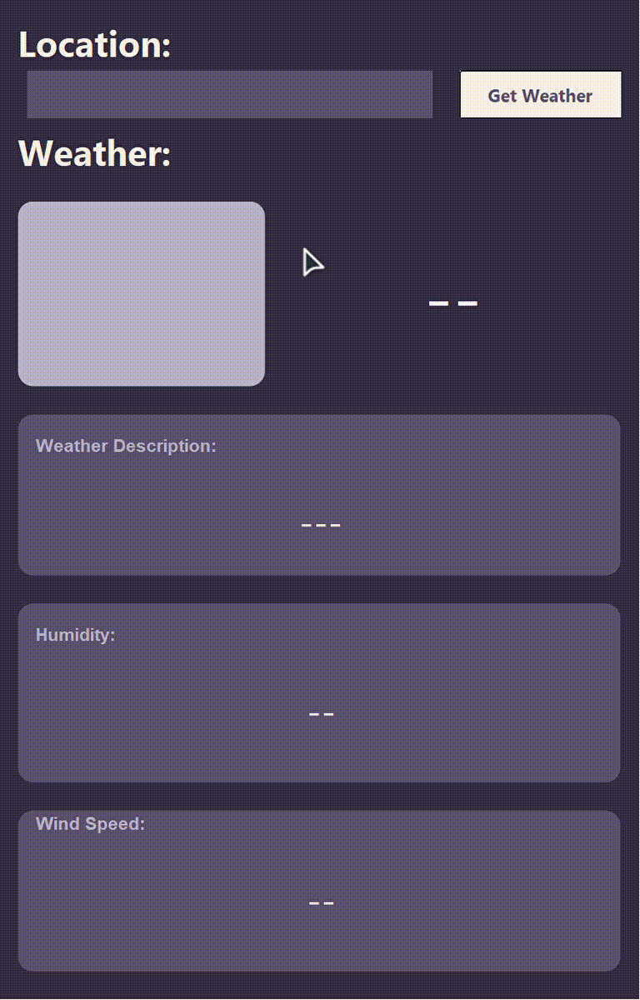

# Weather App using Java

This Weather App is made in Java using Java swing component and Openweathermap API for the data.

# Demo

# Installation

 There are 2 ways, you can try this game yourself:
- download the latest release version of this repo
- clone this repo and run using NetBeans

## Contributing

Pull requests are welcome. For major changes, please open an issue first
to discuss what you would like to change.

Please make sure to update tests as appropriate.
